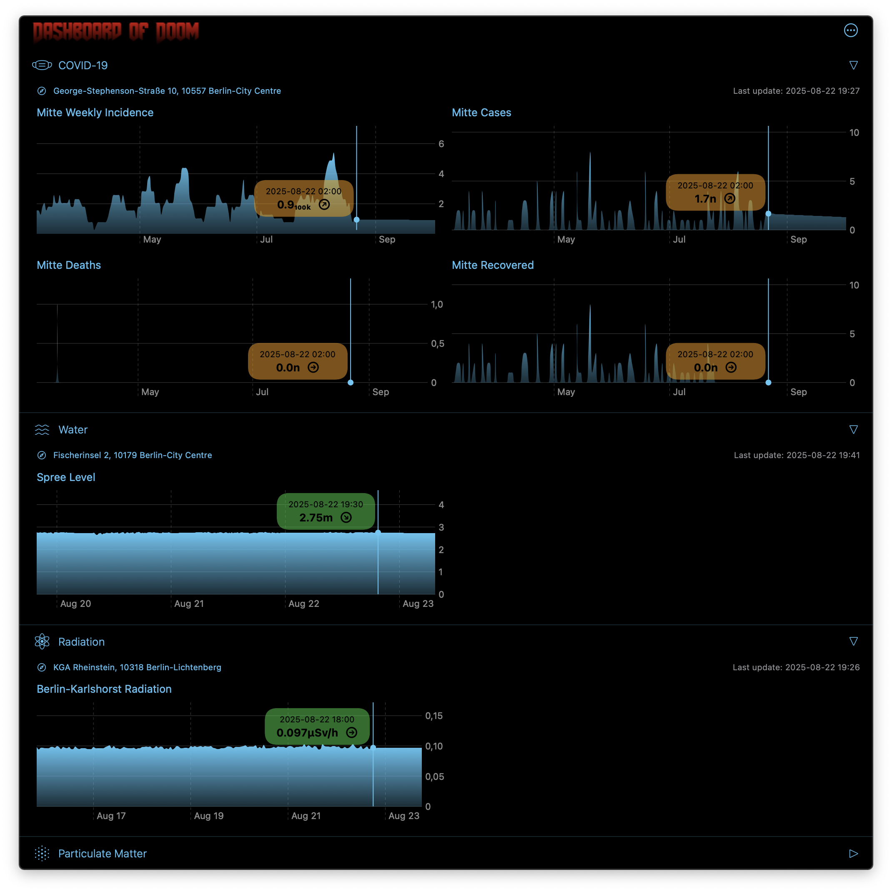
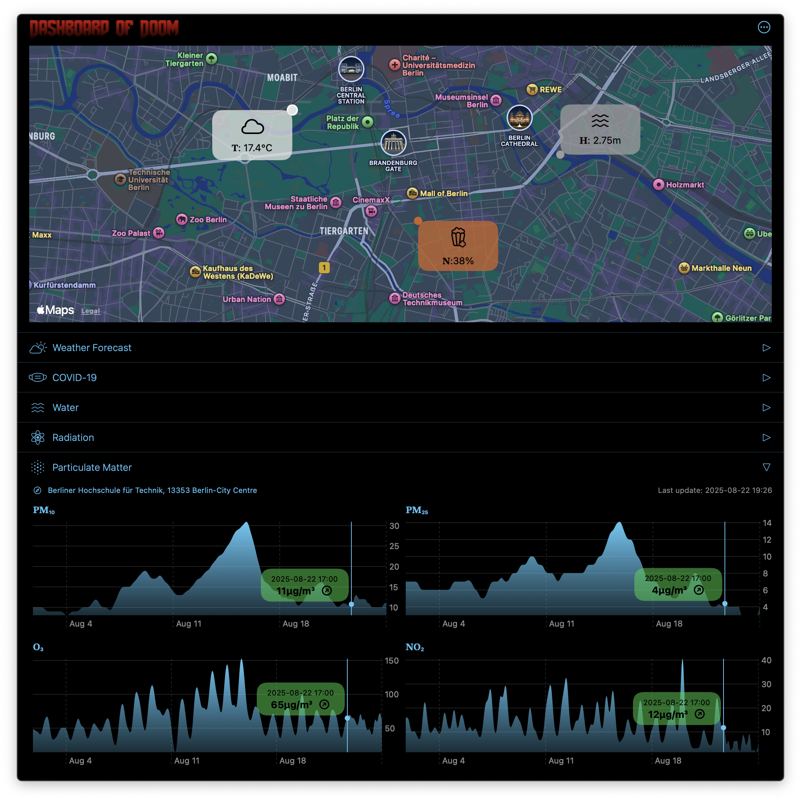
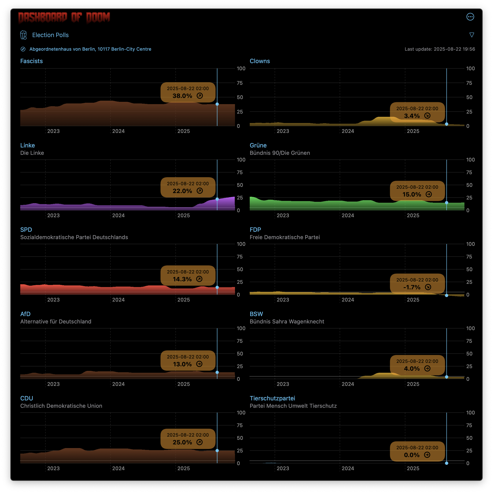
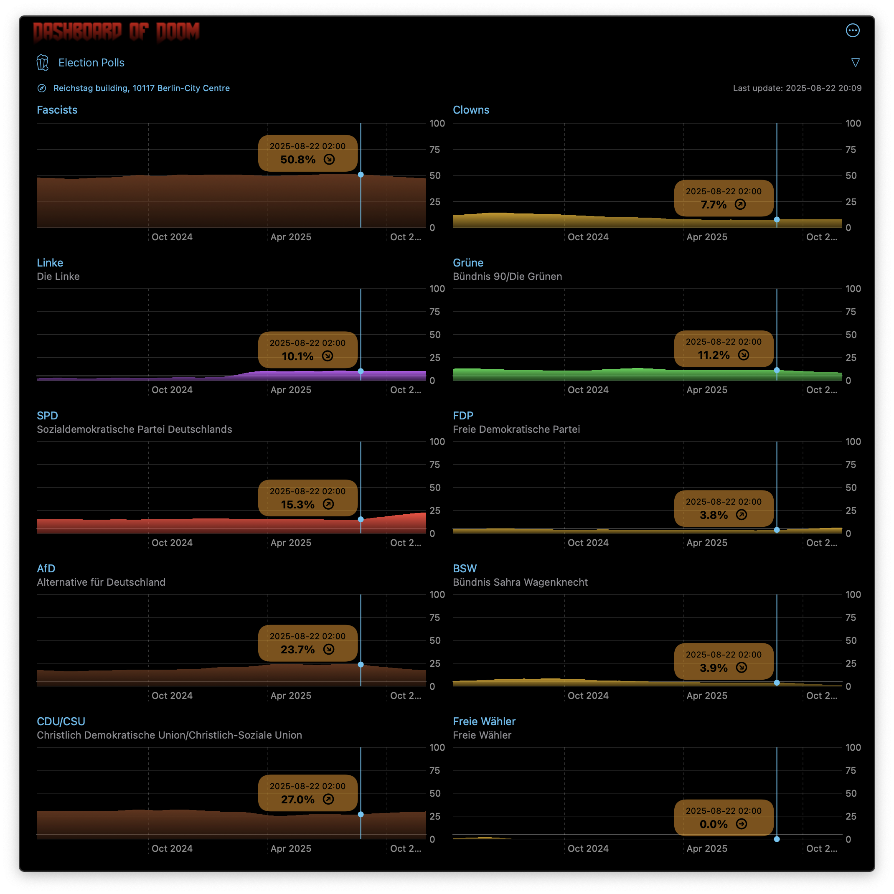

# Dashboard of Doom (macOS and iOS)


**Dashboard of Doom** is a macOS menu bar and iOS application that provides real-time environmental and public health data visualization for Germany. This comprehensive monitoring dashboard aggregates data from multiple German government and public APIs to create an interactive, location-aware environmental monitoring system.

> **Regional Focus**: This application is specifically designed for use in Germany and integrates with German federal data sources.

> **Platforms**: macOS 15+ and iOS 26+. Both apps use the five local DoomKit packages and the app code in `shared/Sources/`. The original iOS history is retained under `ios/`; see [migration and validation](ios/MIGRATION.md).

Current versions: **macOS 6.4.3 (147)** and **iOS 6.3.0 (178)**.

## iOS development

Use Xcode 26.2+, an iOS 26 simulator, and XcodeGen 2.46.0+. The root
`project.yml` generates both targets; the old iOS Xcode project has been retired.

```bash
./ios/build.sh                         # unsigned Debug simulator build
./ios/build.sh --release               # unsigned Release simulator build
./ios/build.sh --device                # signed Debug device build
./ios/build.sh --device --release      # signed Release device build
xcrun simctl list devices available
./ios/build.sh --simulator SIMULATOR_UUID --run
```

`--run` boots the selected simulator, sets **HKW (52.51889, 13.36528)**, installs,
and launches. It does not grant location permission. Use the iOS permission
prompt or `xcrun simctl privacy SIMULATOR_UUID grant location-always com.panjas.dashboard-of-doom`.
Keep simulator movement tests centred on HKW. Build outputs are isolated under
`.build/ios/{simulator,device}/{Debug,Release}/`; this script never cleans.
The existing `./macos/build.sh --clean` removes the entire root `.build/`, including
these iOS outputs. Device builds need the existing team's development identity
and a profile for `com.panjas.dashboard-of-doom`; there is no upload or archive step.

```bash
xcodegen generate
xcrun simctl location SIMULATOR_UUID set 52.51889,13.36528
xcodebuild -project DashboardOfDoom.xcodeproj -scheme iOSTests \
  -destination 'platform=iOS Simulator,id=SIMULATOR_UUID' \
  -parallel-testing-enabled NO -derivedDataPath .build/ios-tests \
  SYMROOT="$PWD/.build/ios-tests/Products" OBJROOT="$PWD/.build/ios-tests/Intermediates" \
  CODE_SIGNING_ALLOWED=NO test
# Use scheme iOSUITests for offline navigation, chart gestures, and POI stress screenshots.
```

`shared/Sources/` contains controllers, presenters, models, transformers, extensions,
and map/POI views. `macos/DashboardOfDoom/` owns macOS app/menu/settings/chart views;
`ios/DashboardOfDoom/` owns iOS app/navigation/settings/chart views and assets.
There is one location manager and coordinator per app. iOS requests best-accuracy
continuous location and Always permission, with background updates, no automatic
pauses, and the background indicator. A movement must exceed 100 metres to be
accepted. Each accepted iOS movement refreshes enabled sources. Backgrounding
keeps location active; becoming active again refreshes once. The OS still controls
background execution, so scheduled intervals are not background delivery guarantees.
macOS retains its kilometer-accuracy foreground policy and first-measurement refresh.

Weather and forecasts continue fetching with their display switch off. Other
sources stop fetching when disabled and retain their last successful data. iOS
keeps `showWater`, `enableElectionPolls` (default off), and `showElectionPolls`
(default on) as separate persisted preferences. Hiding poll labels does not stop
poll fetching. POIs retain their independent master/category controls. The map
can show the fallback location while WeatherKit is unavailable. Hazard UI and
fetching remain dormant. Accent selection persists, and the theme follows the
system unless Always Use Dark Theme is enabled.

## Points of interest

The current version respects disabled data sources while keeping weather
and forecasts current, and uses opaque environmental labels when POIs are enabled.
Points of interest include pharmacies, hospitals, liquor/convenience stores,
funeral directors, and cemeteries. All categories start enabled. Settings > Places
provides a master switch and individual switches with a symbol legend.

Every enabled, valid onscreen place is drawn at its coordinate using a shared
Canvas with one Core Graphics pass, without names, popups, clustering, or thinning. Dense symbols can overlap.
Apple's built-in places remain visible. Environmental dots and labels retain
priority; POIs never enter the label collision solver or change the map region.

The app queries the existing OpenStreetMap/Overpass services within 6,666.67 metres,
including unnamed nodes and ways with valid coordinates. Results have stable OSM
identities and are deduplicated within each category. At most two requests run at
once, including across cancelled refresh generations. Shared Overpass transport
serializes these with COVID district and waterway discovery, giving those
environmental requests priority. Successful per-category
results remain cached for one hour within 1 km of their fetch centre. A minute
check triggers expired refreshes; failures retry after five minutes and retain
applicable cached data. Successful categories appear as each request finishes,
so a slow or failing category does not hold back the others. Settings changes
and movement trigger checks immediately.

Overpass connection/server failures use a secondary public endpoint and temporarily
skip the unavailable endpoint. Rate-limit responses respect a shared cooldown
and never trigger endpoint rotation. If waterway discovery fails, water levels
use the nearest official gauge.

The app delegate starts and stops the POI presenter explicitly. It observes the
existing location stream, including Berlin fallback, without controlling shared
location tracking. Closing the popover retains the cache. Projection updates only
for POI geometry, visibility, viewport, or camera changes, independently of
measurement text. Canvas exposes a single accessible summary of visible category
counts. Dense deterministic previews accompany the normal map fixtures.

## Map annotation layout

Version 6.3.6 (build 143) separates crowded macOS map labels while keeping location
dots at their geographic coordinates. Labels retain their existing appearance and attach directly above-right of their
dots when space permits. Crowded labels use category-colored connectors, which
disappear when space opens up. Direct attachment takes priority over retaining
a previous offset. It preserves every enabled label, using the least-colliding
arrangement found when the viewport is too small. Turning off Weather hides its
label while retaining the location dot.

The map remains noninteractive and retains its existing region-fitting behavior.
`MapView` creates one category-ordered snapshot; `CollisionMapView` projects it
through `MapReader` after geometry changes and caches layout independently of label
text. A cancellable view task handles temporary map-registration gaps. `DoomKitTools.AnnotationLayout` owns the bounded screen-space search.
Deterministic crowded-layout previews live in `MapAnnotationPreview.swift`.
iOS uses the same collision solver and POI rendering, with its existing 101 × 67-point labels. macOS retains 131 × 33-point labels. iOS map labels cap their visual text size to fit those bounds; VoiceOver reads the full value.

## Screenshots

<div align="center">

**Main Dashboard**


**Weather Forecast**


**Environmental Monitoring**


**Particle Analysis**


**State Election Polls**


**Federal Election Polls**


</div>

## Features

### macOS Menu Bar Application

- **Lightweight Menu Bar Extra**: Quick access to current conditions from system tray
- **Live Temperature Display**: Real-time temperature in menu bar status item
- **Streamlined Header Bar**: Direct action buttons for settings and quit (no menu needed)
- **Adaptive Branding**: Text title in light mode, logo image in dark mode
- **Settings Window**: Comprehensive configuration for preferences and data sources
- **Dark Mode Optimized**: Native macOS appearance with pure black backgrounds
- **System Integration**: Native macOS notifications and alerts
- **Low Resource Usage**: Optimized for background operation with minimal system impact

### Data Sources & Monitoring

- **COVID-19 Tracking**: Real-time incidence rates, cases, deaths, and recovery data
- **Radiation Monitoring**: Federal radiation levels from BfS (Bundesamt für Strahlenschutz)
- **Air Quality**: PM10, PM2.5, O3, NO2 particle concentrations from UBA
- **Weather & Forecasting**: Current conditions and ARIMA-based future predictions
- **Water Levels**: Hydrological data from federal waterway stations
- **Civil Protection**: NINA hazard alerts and emergency notifications
- **Political Surveys**: Election polling data and trend analysis
- **Points of Interest**: Nearby hospitals, pharmacies, and essential services

### Advanced Capabilities

- **Automatic Data Refresh**: Intelligent subscription-based updates
- **Quality Assessment**: Built-in data validation and quality scoring
- **Trend Analysis**: Mathematical trend indicators with Unicode symbols (Ω, Γ, ρ, etc.)
- **Location Intelligence**: GPS-based data filtering and regional focus
- **Network Resilience**: Robust error handling with automatic retry mechanisms

## Architecture & Design

### Architecture Pattern

- **MVP (Model-View-Presenter)**: Optimized for menu bar applications with reactive state management
- **Environment-Based Injection**: SwiftUI environment pattern for presenter dependencies
- **Observable State**: Modern `@Observable` macro for reactive UI updates

### Core Architecture Components

```text
┌─────────────────┐    ┌─────────────────┐    ┌─────────────────┐
│   Controllers   │────│    Services     │────│  External APIs  │
│  Data Fetching  │    │  HTTP/Network   │    │ German Federal  │
└─────────────────┘    └─────────────────┘    └─────────────────┘
         │                       │                       │
         ▼                       ▼                       ▼
┌─────────────────┐    ┌─────────────────┐    ┌─────────────────┐
│  Transformers   │────│   Presenters    │────│     Views       │
│ Data Processing │    │ State Management│    │ SwiftUI Interfaces│
└─────────────────┘    └─────────────────┘    └─────────────────┘
```

#### Data Flow Pipeline

1. **Controllers**: Orchestrate API communication and data parsing
2. **Services**: Handle HTTP requests to German federal APIs
3. **Transformers**: Process raw data into UI-ready formats with quality assessment
4. **Presenters**: Manage application state using `@Observable` macro
5. **Views**: SwiftUI interfaces with environment-based dependency injection

#### Key Design Patterns

- **Subscription System**: `AppProcess.shared` constructs the package coordinator that connects location/network streams to `DoomKitProcess.ProcessManager`
- **Observer Pattern**: `ProcessRefreshable` protocol for reactive components
- **Transformer Pattern**: Clean separation of data processing from presentation
- **Quality Assessment**: Built-in measurement validation and confidence scoring

## Technical Implementation

### Modern Swift Features

- **Swift 5 language mode**: Modern Swift compiler with async/await support
- **Concurrency**: Comprehensive async/await implementation
- **Observable Macro**: macOS 15+ state management with `@Observable`
- **Environment Injection**: SwiftUI environment-based dependency management
- **Sendable Conformance**: Proper thread-safety with `@unchecked Sendable` for custom types

### Data Processing Excellence

- **Real-time Transformations**: Sophisticated data normalization pipeline
- **Mathematical Analysis**: Trend calculation and statistical processing
- **Unit Standardization**: Automatic measurement unit conversion
- **Quality Metrics**: Data confidence and reliability assessment

### Network Architecture

- **Resilient Networking**: Automatic retry with exponential backoff
- **Connection Monitoring**: Network availability detection and adaptation
- **API Integration**: RESTful services with comprehensive error handling
- **Data Validation**: JSON parsing with type safety and error recovery

## Project Structure

```text
dashboard-of-doom-mac/
├── macos/
│   ├── DashboardOfDoom/     # macOS app, views, assets and entitlements
│   ├── Tests/               # macOS rendering tests
│   ├── BuildTests/          # macOS build and notarization script tests
│   ├── images/              # macOS documentation screenshots
│   ├── build.sh             # Signed builds and distribution
│   └── exportOptions.plist
├── ios/
│   ├── DashboardOfDoom/     # iOS app, views, assets and entitlements
│   ├── Tests/               # iOS policies and rendering tests
│   ├── UITests/             # iPhone and iPad UI tests
│   ├── BuildTests/          # iOS build script tests
│   ├── build.sh             # Device and simulator builds
│   └── MIGRATION.md
├── shared/
│   ├── Sources/             # Shared controllers, presenters and map views
│   ├── Tests/               # Common app tests, compiled on both platforms
│   ├── build_support/       # Shared Python test helper
│   ├── doom-kit-location/   # Local packages include their own tests
│   ├── doom-kit-network/
│   ├── doom-kit-process/
│   ├── doom-kit-tools/
│   ├── doom-kit-services/
│   └── PACKAGE_VALIDATION.md
├── project.yml              # Authoritative combined XcodeGen specification
├── DashboardOfDoom.xcodeproj/ # Generated project; package lockfile tracked
├── AGENTS.md
├── UPDATES.md
├── LICENSE
└── README.md
```

### Specialized Components

#### Presenters (State Management)

- `WeatherPresenter` - Current weather conditions and atmospheric data
- `ForecastPresenter` - Weather predictions with ARIMA forecasting models
- `CovidPresenter` - COVID-19 epidemiological data and trends
- `LevelPresenter` - Hydrological measurements and water level monitoring
- `RadiationPresenter` - Environmental radiation monitoring and alerts
- `ParticlePresenter` - Air quality measurements (PM10, PM2.5, O3, NO2)
- `SurveyPresenter` - Political polling data and electoral trend analysis
- `HazardPresenter` - Civil protection alerts and emergency notifications
- `MapPresenter` - Shared geographic state and location management

#### Data Sources Integration

- **BfS (Bundesamt für Strahlenschutz)**: Radiation monitoring network
- **UBA (Umweltbundesamt)**: Federal environmental agency air quality data
- **Pegelonline**: Federal waterway and shipping administration data
- **NINA API**: National warning system for civil protection
- **Corona-Zahlen.org**: COVID-19 statistics aggregation service
- **OpenStreetMap**: Geographic data and points of interest
- **DAWUM**: Political polling and survey data aggregation

## Getting Started

### Prerequisites

- **macOS 15.0+** (Sequoia or later)
- **Xcode 26.2+** with Swift 6.2 and macOS SDK
- **XcodeGen 2.46.0+** (`brew install xcodegen`)
- **Swift 6.2+ compiler**; the app stays in Swift 5 language mode and local packages use Swift 6
- **Apple Developer Account** (for code signing)

### Installation & Setup

1. **Clone the Repository**

   ```bash
   git clone https://github.com/heikopanjas/dashboard-of-doom-mac.git
   cd dashboard-of-doom-mac
   ```

2. **Generate and Open the Project**

   ```bash
   xcodegen generate
   open DashboardOfDoom.xcodeproj
   ```

   `project.yml` is the source of truth for targets, build settings, package
   dependencies, and the shared scheme. Run `xcodegen generate` after cloning
   and before building, especially after pulling changes or editing the spec.
   Generated project files are ignored; changes made directly in Xcode's
   project editor are overwritten by regeneration.

3. **Configure Signing**

   The specification preserves the existing manual Developer ID signing:
   team `8J2G689FCZ`, bundle ID `com.panjas.dashboard-of-doom`, and provisioning
   profile `Dashboard of Doom macOS`. Running or distributing the app requires
   the corresponding certificate and profile, including WeatherKit support.
   For a different team, update the signing settings in `project.yml`, including
   the `sdk=macosx*` overrides, and regenerate. Keep the WeatherKit entitlement
   in `DashboardOfDoom/DashboardOfDoom.entitlements`.

4. **Build and Run**
   - Select the `DashboardOfDoom` scheme and "My Mac" destination
   - Build and run (⌘R)
   - Grant location permissions when prompted
   - Menu bar icon will appear in the system tray

### Build Script

Run the executable script from the repository root (or invoke it by its path
from another directory). It regenerates the Xcode project before each build.

| Command | Action | Output |
| --- | --- | --- |
| `./macos/build.sh` | Signed Debug build | `.build/Products/Debug/Dashboard of Doom.app` |
| `./macos/build.sh --clean` | Delete build outputs and exit | Removes root `.build/`, `Build/`, and legacy `build/` |
| `./macos/build.sh --release` | Signed Release build | `.build/Products/Release/Dashboard of Doom.app` |
| `./macos/build.sh --notarize` | Archive Release, export, notarize, staple, verify | `.build/export/Dashboard of Doom.app` and `.build/Dashboard of Doom.zip` |

Combine `--clean` with `--release` or `--notarize` to clean before that operation.
For a clean Debug build, run `./macos/build.sh --clean` followed by `./macos/build.sh`.
Cleaning removes compiled products, intermediate files, caches, archives, and
exports in those root directories. It preserves sources, the package lockfile,
and build folders inside `Packages/`. The script fixes output paths explicitly
so machine-specific Xcode preferences do not redirect its artifacts.

Notarization uses `macos/exportOptions.plist` for Developer ID export and the existing
Keychain credential profile `DashboardOfDoom-Notarize`. Set up credentials once:

```bash
xcrun notarytool store-credentials DashboardOfDoom-Notarize
```

To use another stored profile:

```bash
NOTARIZE_PROFILE=YourProfile ./macos/build.sh --notarize
```

`--notarize` uploads the exported app to Apple and waits for the result. It staples
only an accepted submission, validates the ticket, checks Gatekeeper acceptance,
and recreates the ZIP with the stapled app. Submission output remains at
`.build/notarization-result.plist` for diagnosis. The archive is retained at
`.build/Dashboard of Doom.xcarchive`. See Apple's
[notarization workflow](https://developer.apple.com/documentation/security/customizing-the-notarization-workflow).

For a compile check without signing credentials:

```bash
xcodegen generate
xcodebuild -project DashboardOfDoom.xcodeproj \
  -scheme DashboardOfDoom -configuration Debug \
  -destination 'platform=macOS' -derivedDataPath Build/DerivedData \
  -disableAutomaticPackageResolution CODE_SIGNING_ALLOWED=NO build
```

Use a signed build to verify WeatherKit, location permissions, and menu bar
behavior at runtime.

The LaunchAtLogin dependency retains its `main` branch requirement and the revision
recorded in `DashboardOfDoom.xcodeproj/project.xcworkspace/xcshareddata/swiftpm/Package.resolved`.
This lockfile remains tracked even though the rest of the project is generated.
Keep lockfile changes intentional when updating dependencies. Initial package
checkout requires network access.

See [package validation](shared/PACKAGE_VALIDATION.md) for completed checks and remaining
interactive smoke tests.

The five local packages support macOS 15 and iOS 26. Both app targets use Swift 5 language mode; packages use Swift 6 with tools 6.2. See
[DoomKitLocation](shared/doom-kit-location/README.md),
[DoomKitNetwork](shared/doom-kit-network/README.md),
[DoomKitProcess](shared/doom-kit-process/README.md),
[DoomKitTools](shared/doom-kit-tools/README.md), and
[DoomKitServices](shared/doom-kit-services/README.md) for API and lifecycle contracts.
Native location live updates are a planned provider replacement, not implemented
by this migration. The integration retains CLLocationManager and tests its platform policies independently.

Run package tests before the signed app build:

```bash
swift test --package-path shared/doom-kit-location
swift test --package-path shared/doom-kit-network
swift test --package-path shared/doom-kit-process
swift test --package-path shared/doom-kit-tools
swift test --package-path shared/doom-kit-services
swift test -c release --package-path shared/doom-kit-process
swift test -c release --package-path shared/doom-kit-tools
swift test -c release --package-path shared/doom-kit-services
./macos/build.sh
./macos/build.sh --release
```

The unhosted `PointOfInterestTests` target covers source subscription lifecycles,
weather scheduling, POI models and fetching, projection, and label rendering. It does not launch the
app or use live network requests. Its source membership is specified using a
filtered synchronized folder in `project.yml`:

```bash
xcodegen generate
xcodebuild -project DashboardOfDoom.xcodeproj -scheme PointOfInterestTests \
  -destination 'platform=macOS' -derivedDataPath .build/poi-tests test
```

Build script tests use Python 3 and mock
external tools, including notarization; they perform no uploads:

```bash
python3 -m unittest discover -s macos/BuildTests -v
python3 -m unittest discover -s ios/BuildTests -v
bash -n macos/build.sh
shellcheck macos/build.sh
```

Install ShellCheck with `brew install shellcheck` if needed. Define future app
test targets in `project.yml`.

### Permissions & Configuration

- **Location Services**: Required for geographic data filtering and location-based environmental data
- **Network Access**: Essential for API communication with German federal data sources
- **Notifications**: Optional for civil protection alerts and hazard warnings

## 🧩 Development & Contribution

### Code Architecture Principles

1. **Separation of Concerns**: Clear boundaries between data, business logic, and presentation
2. **Reactive Programming**: Observable state management with SwiftUI integration
3. **Error Resilience**: Comprehensive error handling and recovery mechanisms
4. **Performance Optimization**: Efficient data processing and memory management
5. **Menu Bar Optimization**: Lightweight operation with minimal system resource usage

### Development Workflow

```bash
# Development branch workflow
git checkout develop
git pull origin develop

# Create feature branch
git checkout -b feature/your-feature-name

# Make changes and commit
git add .
git commit -m "feat: add your feature description"

# Push and create pull request
git push origin feature/your-feature-name
```

### Testing Strategy

- **Unit Tests**: Core business logic and data transformations
- **Integration Tests**: API communication and data pipeline validation
- **UI Tests**: SwiftUI interface behavior and user interaction flows
- **Performance Tests**: Memory usage and data processing efficiency

## Data Quality & Reliability

### Quality Assessment System

- **Data Validation**: Real-time measurement verification
- **Confidence Scoring**: Statistical reliability assessment
- **Temporal Analysis**: Historical data consistency checking
- **Source Verification**: API endpoint health monitoring

### Update Frequencies

- **Weather Data**: 5-minute intervals
- **Air Quality**: 30-minute intervals
- **Water Levels**: 15-minute intervals
- **COVID-19 Data**: 6-hour intervals
- **Radiation Monitoring**: Real-time continuous updates
- **Civil Protection**: Immediate emergency notifications

## Privacy & Security

### Data Handling

- **Location Privacy**: GPS data processed locally, never transmitted
- **API Security**: Secure HTTPS communication with government endpoints
- **Data Retention**: Minimal local caching with automatic cleanup
- **User Control**: Granular privacy settings and data source toggles

---

Built with care in Swift for the German environmental monitoring community
